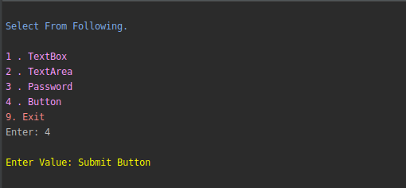
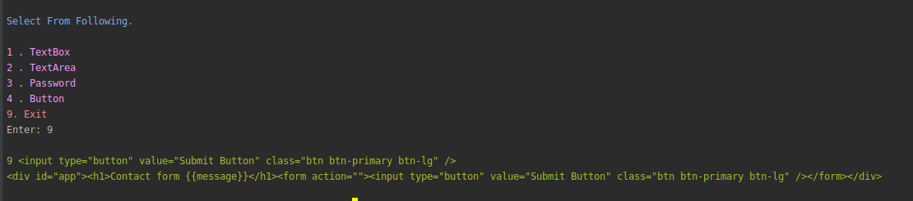

### Install Requirements
```ssh
pip install -r requirements.txt
```

#### Run file
```ssh
python UserSelections.py
```
##### Follow step and Generate Form, it will generate html file.





##### Supported Fields
- Text Field
- Email Field
- Password Field
- Select Field
- Radio Field
- Checkbox
- Buttons
- Date
- Time
- Month
- Week
- DateTime

##### incoming

- number
- range
- color
- search
- file

##### VueJS(v-model) Integration Added in all above fields